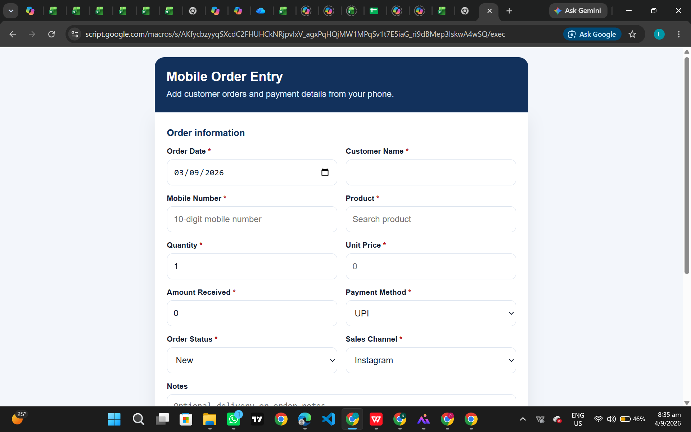
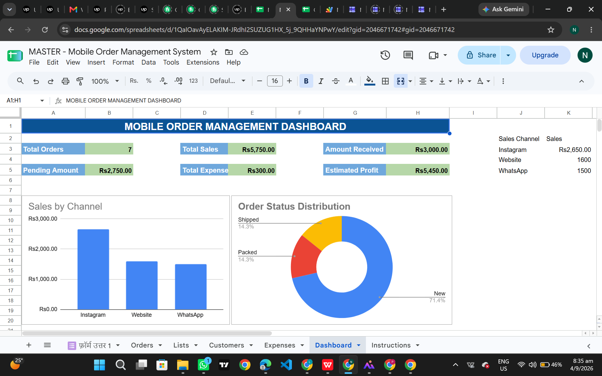

# Mobile Order Management System

A mobile-friendly business automation system built for small sellers who manage customer orders through WhatsApp or Instagram.

## Problem

Manual order tracking can cause missed orders, incorrect payment records and difficulty checking business performance.

## Solution

This system allows users to enter orders through a simple mobile interface. The data is automatically stored in Google Sheets and displayed through an organised dashboard.

## Features

* Secure PIN-based access
* Mobile-friendly order entry form
* Automatic Order ID generation
* Customer and product tracking
* Payment and expense management
* Automatic summary calculations
* Business performance dashboard
* Wrong PIN access blocking

## Technology Used
## Screenshots

### Mobile Order Entry

### Automated Dashboard

* Google Sheets
* Google Apps Script
* HTML
* CSS
* JavaScript

## Workflow

1. User signs in using the business PIN.
2. Order details are entered through the mobile form.
3. Apps Script validates and stores the information.
4. Google Sheets updates the records and dashboard automatically.

## Use Cases

* Instagram sellers
* WhatsApp-based businesses
* Boutiques
* Home-based product sellers
* Small retail businesses

## Security Note

Passwords, business PINs and real customer information are not included in this public repository.

## Project Status

Completed and successfully tested.
